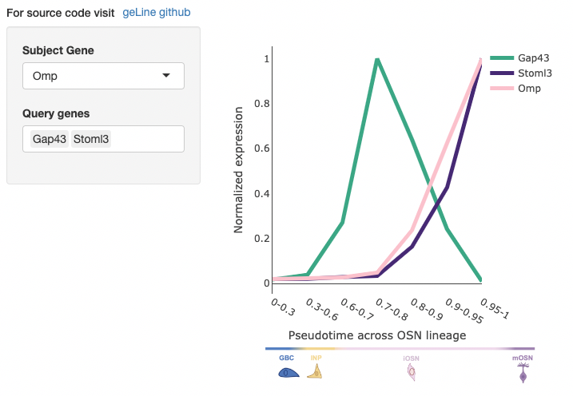

# geLine

Welcome to geLine. 

[geLine](https://justice-lu.shinyapps.io/geLine/) app is a basic tool that allow you to visualize the gene expression trajectory across the neuronal lineage of the olfactory sensory neurons. 

## About geLine 
`Subject Gene` : A single gene of interest.  
`Query Gene` : List of genes to calculate expression trajectory difference against `Subject Gene`. 

`Y axis` : Normalized gene expression. Every gene's expression count is normalized by it's minimum and maximum counts.  
`X axis` : Contains continuous value of diffusion pseudotime value. This represents how mature is the given cell in the olfactory sensory neurons lineage.  
`Color/Hover` :  Color and hover value displays the RMSD of how far apart is the query gene compared to the subject gene's trajectory.  

## Acknowledgements
The single-cell RNAseq data is downloaded from [Brann et al.](https://www.science.org/doi/10.1126/sciadv.abc5801?url_ver=Z39.88-2003&rfr_id=ori:rid:crossref.org&rfr_dat=cr_pub%20%200pubmed) and reanalyzed using python with [scanpy](https://scanpy.readthedocs.io/en/stable/) library. The app itslef is built in R with [shiny app](https://shiny.rstudio.com/).